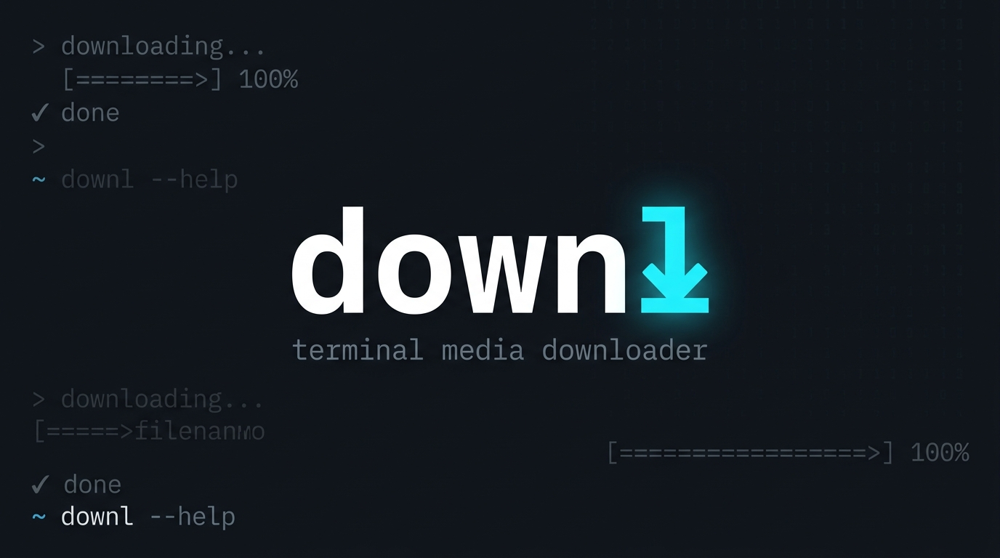

<p align="center">
  
</p>

<p align="center">
  <b>Одна команда — скачивает всё.</b><br>
  <sub>YouTube · Spotify · SoundCloud · TikTok · Instagram · Twitter/X · и 1800+ других сайтов</sub>
</p>

<p align="center">
  
  
  
  
</p>

---

## ✨ Возможности

| | Функция | Описание |
|---|---|---|
| 🎬 | **YouTube** | Выбор качества: 1080p / 720p / 480p / 360p / аудио / лучшее |
| 🎵 | **Spotify** | Треки, альбомы, плейлисты через [spotdl](https://github.com/spotDL/spotify-downloader) |
| 🎧 | **SoundCloud** | Треки и плейлисты |
| 📱 | **Соцсети** | TikTok, Instagram, Twitter/X, Reddit, Facebook |
| 📺 | **Видео** | Twitch, Vimeo, Dailymotion, VK, Rutube, Kick и др. |
| 📂 | **Автосортировка** | Файлы раскладываются по папкам площадок |
| 📁 | **Плейлисты** | Подпапки с названием плейлиста |
| 📊 | **Pacman-style** | Прогресс-бар как при `sudo pacman -S` |

## 📦 Установка

### Требования

- Python 3.11+
- ffmpeg

```bash
# Arch / CachyOS / Manjaro
sudo pacman -S python ffmpeg

# Fedora
sudo dnf install python3 python3-pip ffmpeg-free

# Ubuntu / Debian
sudo apt install python3 python3-venv ffmpeg

# openSUSE
sudo zypper install python3 ffmpeg
```

### Установка downl

```bash
git clone https://github.com/stufyyyyn/downlviaterminal.git
cd downlviaterminal
chmod +x install.sh
./install.sh
```

> Установщик предложит выбрать папку для загрузок, автоматически определит вашу оболочку (Fish / Zsh / Bash), создаст виртуальное окружение и настроит команду `downl`.

## 🚀 Использование

```bash
# YouTube — с выбором качества
downl https://www.youtube.com/watch?v=dQw4w9WgXcQ

# Spotify — трек
downl https://open.spotify.com/track/4PTG3Z6ehGkBFwjybzWkR8

# Spotify — плейлист (создаст подпапку)
downl https://open.spotify.com/playlist/...

# SoundCloud
downl https://soundcloud.com/artist/track

# Несколько ссылок сразу
downl https://youtube.com/watch?v=... https://soundcloud.com/...
```

## 📂 Структура папок

```
~/Загрузки/медиа/          ← путь настраивается при установке
├── YouTube/
│   └── Название.mp4
├── Spotify/
│   └── Альбом/
│       └── Трек — Артист.mp3
├── SoundCloud/
│   └── Плейлист/
│       └── Трек.mp3
├── TikTok/
├── Instagram/
├── Twitter/
└── ...
```

## 🎬 YouTube — выбор качества

При скачивании с YouTube появляется интерактивное меню:

```
🎬 Выберите качество:
────────────────────────────────────────
  1 │ 1080p
  2 │ 720p
  3 │ 480p
  4 │ 360p
  5 │ Только аудио (mp3)
  6 │ Лучшее доступное
────────────────────────────────────────
▸ Ваш выбор [1-6, Enter=6]:
```

## 📊 Прогресс-бар

Загрузка отображается в стиле pacman — одна обновляемая строка:

```
 Название трека        12.3 MiB   1.5 MiB/s 00:42 [################---------]  68%
```

## ⚙️ Конфигурация

Настройки хранятся в `~/.config/downl/config.json`:

```json
{
  "download_dir": "/home/user/Загрузки/медиа"
}
```

Измените `download_dir` чтобы поменять папку загрузок, или запустите `./install.sh` заново.

## 🔧 Поддерживаемые площадки

<details>
<summary><b>Полный список (30+)</b></summary>

| Площадка | Поддержка |
|----------|-----------|
| YouTube | ✅ видео, плейлисты, shorts |
| YouTube Music | ✅ треки, альбомы |
| Spotify | ✅ треки, альбомы, плейлисты |
| SoundCloud | ✅ треки, плейлисты |
| TikTok | ✅ видео |
| Instagram | ✅ reels, посты |
| Twitter / X | ✅ видео |
| Twitch | ✅ стримы, клипы, VOD |
| Reddit | ✅ видео |
| Vimeo | ✅ видео |
| Dailymotion | ✅ видео |
| VK | ✅ видео |
| Rutube | ✅ видео |
| Bandcamp | ✅ треки, альбомы |
| Mixcloud | ✅ миксы |
| Bilibili | ✅ видео |
| OK.ru | ✅ видео |
| Facebook | ✅ видео |
| Kick | ✅ стримы |
| + 1800 других | ✅ через yt-dlp |

</details>

## 📄 Лицензия

[MIT](LICENSE)
